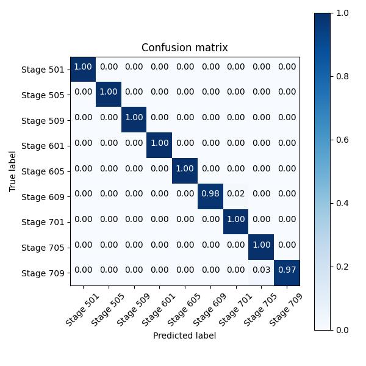

# FinalProject-DataScience

## Install and Run the Code
1. Pull the repository
```
git clone "https://github.com/Aquos06/FinalProject-DataScience.git"
```
2. Download file from https://drive.google.com/drive/folders/1R-aoylWlTRg9BN0kXsF-7sZDfJmzMRQe
3. Open Pinapple.pynb File
```Python
//goto your Folder
cd ...
code .
```
4. Run all

## Result
You can download the best weights "best.pt". 
In validation dataset, the weights have around 96% accuracy

### Confussion Matrix



